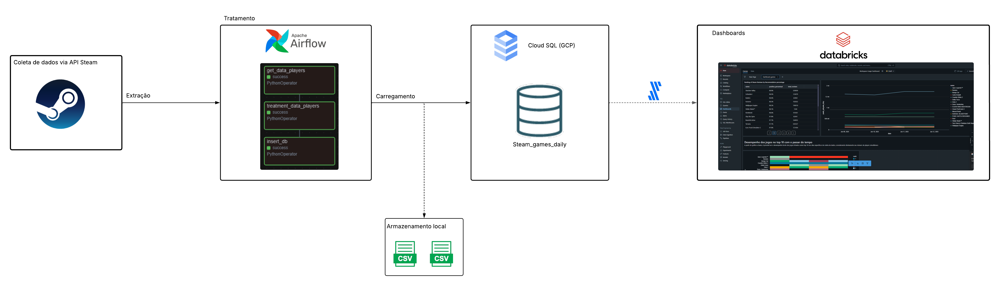
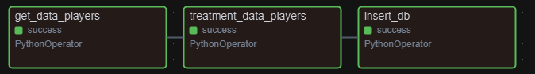
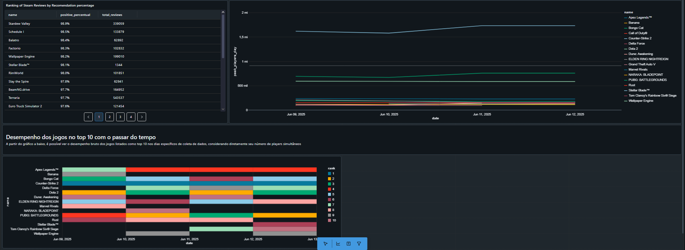

# 🎮 Steam Leaderboard Data Pipeline

Este é um projeto de engenharia de dados desenvolvido para coletar, tratar, armazenar e analisar dados dos leaderboards da Steam. O pipeline automatiza todas as etapas usando Apache Airflow, com armazenamento em PostgreSQL na Google Cloud Platform (GCP) e geração de relatórios no Databricks.

---
## Motivação
A motivação desse projeto, assim como o projeto [Steam Games Dataset](https://www.kaggle.com/datasets/srgiomanhes/steam-games-dataset-2025), vem da minha paixão por jogos eletrônicos e meu contato diário com a plataforma Steam. Sempre gostei de acompanhar as estatísticas de jogos, especialmente os leaderboards para jogos online e grandes lançamentos. Com isso, veio a ideia de fazer isso eu mesmo, porém, de forma automatizada.

---
## 🧩 Arquitetura do Projeto

---

## 📦 Tecnologias Utilizadas

- **Apache Airflow**: Orquestração de pipelines de dados.
- **Python**: Scripts de coleta e tratamento de dados.
- **Google Cloud Platform (GCP)**: Hospedagem do banco de dados PostgreSQL.
- **PostgreSQL**: Armazenamento estruturado dos dados.
- **Steam Web API**: Fonte dos dados de leaderboard.
- **Databricks**: Geração e visualização de relatórios analíticos.

---

## Objetivo do Projeto

Criação de um pipeline de dados que automatiza a coleta, tratamento e análise de dados dos leaderboards da Steam, permitindo insights sobre o desempenho dos jogos e jogadores diariamente. Além disse, pode servir para armazenar dados legados de jogos, possibilitando análises históricas e comparativas.

A motivação principal foi de acompanhar grandes lançamentos de jogos e tentar prever o sucesso de vendas e o comportamento dos jogadores com o passar do tempo de lançamento e comparar jogos Indie com jogos AAA.

## 📊 Funcionalidades

- **Coleta de Dados**: Scripts Python que utilizam a Steam Web API para coletar dados dos leaderboards. Esses dados são providos diretamente pela API da Steam, garantindo atualizações diárias.

- **Tratamento de Dados**: Processamento e limpeza dos dados coletados para garantir qualidade e integridade. Nesse processo, como a steam não fornece todos os dados dos jogos na requisição de leaderboards, foi usado o dataset, criado por mim mesmo "steam-games-dataset", que contém informações adicionais sobre os jogos, como nome, desenvolvedor, gênero e avaliação. Isso enriquece os dados coletados e permite análises mais profundas.

- **Orquestração**: Utilização do Apache Airflow para agendar e monitorar as tarefas de coleta e tratamento de dados, garantindo que o pipeline seja executado diariamente. O servidor do airflow é rodado localmente e executado via docker, facilitando a gestão e escalabilidade do pipeline. 
Para isso, foi utilizada apenas uma DAG, que é responsável por orquestrar todas as tarefas do pipeline, desde a coleta até o armazenamento dos dados.

- **Armazenamento**: Dados estruturados armazenados em um banco de dados PostgreSQL na GCP.

- **Análise e Relatórios**: Geração de relatórios analíticos no Databricks, utilizando sua mais nova versão Free, que substitui o Comunity Edition, permitindo visualização e insights sobre os dados.

## Conclusões

O projeto demonstra a viabilidade de um pipeline de dados completo, desde a coleta até a análise, utilizando tecnologias modernas e escaláveis. A integração entre Apache Airflow, GCP e Databricks permite uma solução robusta para análise de dados de jogos, com potencial para ser expandida para outros tipos de dados e análises. Além disso, a utilização de dados atuais, atualizados diariamente e com grande taxa de usabilidade, garante que as análises sejam relevantes e aplicáveis ao mercado de jogos. Isso serve de exemplo e inspiração para outros projetos de engenharia de dados, especialmente na área de jogos e entretenimento digital. Plataformas como SteamDB fazem um ótimo trabalho na coleta e análise de dados históricos de jogos. 

## Projetos futuros

- **Expansão do Pipeline**: Adicionar mais fontes de dados, como dados de vendas e avaliações de usuários, para enriquecer ainda mais as análises.
- **Atualização de dados de jogos semanalmente**: Implementar uma rotina para atualizar os dados dos jogos semanalmente, garantindo que as análises estejam sempre atualizadas.
- **Análise de Tendências**: Desenvolver análises preditivas para identificar tendências no comportamento dos jogadores e no desempenho dos jogos ao longo do tempo.

## Contribuição
Contribuições são bem-vindas! Sinta-se à vontade para abrir issues ou pull requests para melhorias, correções de bugs ou novas funcionalidades.

## 👨‍💻 Autor

Sérgio Manhães [@sergio-UFS](https://github.com/sergio-UFS)

Engenheiro de Computação | UFS
Técnico em Informática | IFS

Engenheiro de Dados
